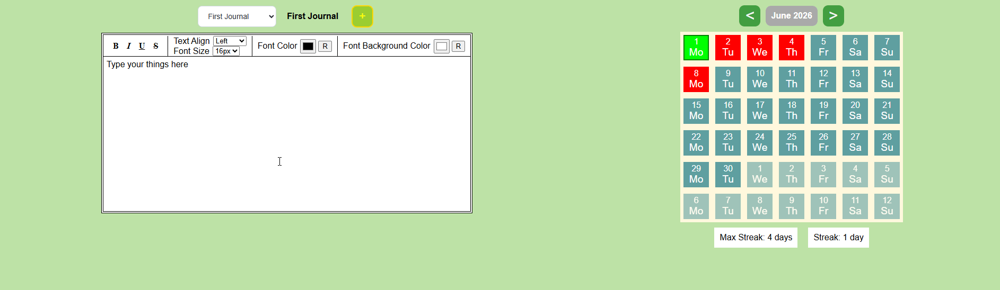

# Journal Tracker 
 + 


  

## Description
Journal Tracker is a web program that allows you to track your thing via text editor. User can freely choose the calendar date to note there something and come back later.  

## Visuals


## Installation
```bash
git clone https://github.com/futsu37/journal-tracker.git
cd journal-tracker
npm install
npm run dev
```

The application will be available at:

`
http://localhost:5173
`
## Usage
Create Journals for things you want to note daily/whenever you want. Switch between dates to edit/read the notes that you have wrotten.

## Contributing

Contributions are welcome.

1. Fork the repository.
2. Create a feature branch:

   `
   git checkout -b feature/my-feature
   `

3. Commit your changes:

   `
   git commit -m "Add my feature"
   `

4. Push your branch:

   `
   git push origin feature/my-feature
   `

5. Open a Pull Request.

## Deployment

This project is configured for deployment to GitHub Pages using a custom domain for the official instance.

If you fork this repository:

- Remove or replace the `CNAME` file with your own domain.
- Update any deployment URLs in `vite.config.js`, `package.json`, or GitHub Actions if applicable.
- Configure GitHub Pages for your own repository.

You do not need the original domain to run the project locally.

## License


## Project Status
The point of this project was to nail down some React skills. I do not intend on adding new features, only fixing bugs. If you intend to continue adding new features, then you are welcome to do so!


